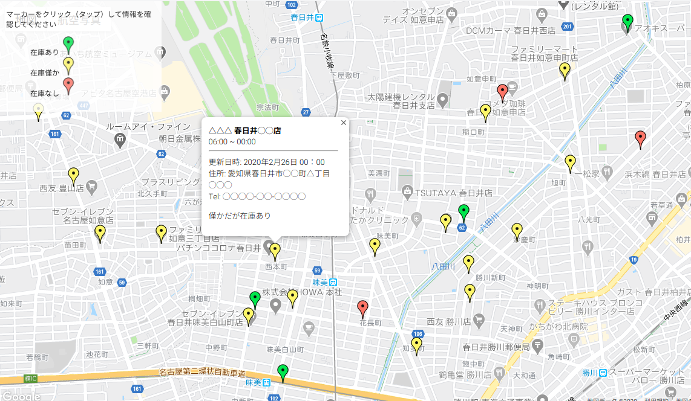

# Info Map App (Static version)  

An easy-to-use app that displays information about a region on Google Maps. 　

Originally, it was created as an app that shows the sales status of masks at neighboring stores.  

NOTE   
_This sentence was created entirely by machine translation._  

## Description  

Only need this　　
- html knowledge
- Get API key for google maps  

Place a marker at any position on google map and click it to display the information in the opened window.　　

The color of the marker can be changed according to the content of information (Valid only for one type of information).　　

The administrator manually updates the information (Therefore, it can be used when the update frequency is about every other day and within a narrow region).

It is easy to use even without advanced knowledge, and I want you to use it according to the actual situation in a very small area (for example, whether relief supplies have arrived at the time of disaster).　　


  

## Usage

To set the center coordinates at the time of display, rewrite "lat" and "lng" in `index.html` with those that have been checked in advance with google map etc. 　

```  
# index.html   

36 ...
37 function initMap() {
38   const mapCenter = {lat: 35.2298613, lng: 136.9541083};
39   let map = new
...
...  
```
 　
To specify the marker position and update the data, rewrite the contents of `js/data.js`.　　

**"Latlng"** determines the marker position. Please type the latitude and longitude where you want to place the marker.　　


```
#js/data.js  

# block No.1
no_△△: {
  "latlng":{lat: 35.2362946, lng: 136.9330821}, // <==
  "stock": "yellow",
  "update": "2020年2月26日 00：00",
  "name": "△△△ 春日井◯◯店",
  "time": "06:00 ~ 00:00",
  "address": "愛知県春日井市◯◯町△丁目◯◯◯",
  "tel": "◯◯◯◯-◯◯-◯◯◯◯",
  "text": "僅かだが在庫あり",
},
# block No.2
no_x: {
  ...
  ...
```

Here, the value of **"marker"** determines the marker color.  
The marker type will be the corresponding value of **"Icons"**.

```

# index.html  

# Icons
28 const Icons = {
29   green :
30   {icon:'https://maps.google.com/mapfiles/ms/icons/green-dot.png'},
31  yellow :
32   {icon: ' https://maps.google.com/mapfiles/ms/icons/yellow-dot.png'},
33   red :
34   {icon:"https://maps.google.com/mapfiles/ms/icons/red-dot.png"},
35 }
...
...
...
# Marker setting
74 const marker = new google.maps.Marker({
75   position: Data[num]['latlng'],
76   map: map,
77   icon: Icons[Data[num]['marker']].icon,
78   title: Data[num]['name'],
79   });
```  

Other values ​​are optional.  
When rewriting, please also change the relevant part of `index.html` (the contents will be displayed in the "Information window").  

Write HTML according to the content you want to display and embed **"${Data[num]['xxx']}"** at the position where you want to embed the value.

Change the "xxx" part to the corresponding value.

```  
# index.html  

...
...
...
for (let num in Data) {
  const infoContent =
    `<span><strong>${Data[num]['name']}</strong></span><br/>
    <span>${Data[num]['time']}</span><br/>
    <hr/>
    <span>更新日時: ${Data[num]['update']}</span><br/>
    <span>住所: ${Data[num]['address']}</span><br/>
    <span>Tel: ${Data[num]['tel']}</span>
    <p>${Data[num]['text']}</p>`;
...
...
...
```  

You can display as many markers as you like!
Please increase the **block** of `data.js`.
